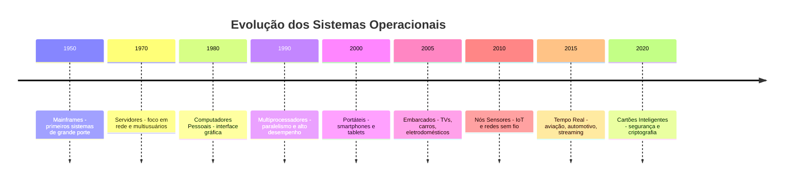
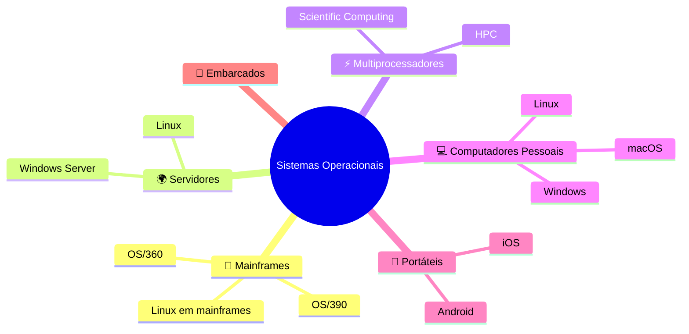

# 🌐 Conceitos, Funções e Tipos de Sistemas Operacionais

## 📌 O que é um Sistema Operacional?
Um **Sistema Operacional (SO)** é o software que gerencia o hardware e fornece serviços para os programas.  
Ele funciona como um **intermediário** entre o usuário e a máquina.

---

## 🖥️ Tipos de Sistemas Operacionais

### 🏢 Sistemas de Grande Porte (Mainframes)
- Alta confiabilidade e disponibilidade
- Processamento em lote e transações massivas
- Usados em bancos, e-commerce e grandes varejistas

**Exemplos:** OS/360, OS/390, Linux em mainframes, variantes UNIX

---

### 🌍 Sistemas de Servidor
- Atendem múltiplos usuários via rede
- Foco em estabilidade e escalabilidade
- Compartilhamento de recursos

**Exemplos:** Linux, Windows Server

---

### ⚡ Sistemas de Multiprocessadores
- Suportam múltiplas CPUs/núcleos
- Desafios: escalonamento, sincronização, coerência de cache
- Usados em servidores de alto desempenho e computação científica

---

### 💻 Sistemas de Computadores Pessoais
- Orientados a um único usuário
- Interface gráfica, multiprogramação e multimídia

**Exemplos:** Windows, macOS, Linux

---

### 📱 Sistemas Portáteis
- Gerenciamento agressivo de energia
- APIs para sensores (GPS, câmera, acelerômetro)
- Segurança por permissões

**Exemplos:** Android, iOS

---

### 🔧 Sistemas Embarcados
- Executam em dispositivos dedicados (micro-ondas, TVs, carros)
- Recursos limitados, software em ROM/flash
- Alguns usam Embedded Linux, QNX, VxWorks

---

### 🌱 Sistemas de Nós Sensores
- Dispositivos pequenos e com bateria limitada
- Comunicação sem fio, orientados a eventos
- Usados em agricultura de precisão, monitoramento ambiental

**Exemplos:** TinyOS, Contiki

---

### ⏱️ Sistemas de Tempo Real
- **Hard Real-Time:** falha pode causar desastre (ex.: controle de voo)
- **Soft Real-Time:** degradação aceitável (ex.: streaming de mídia)

---

### 💳 Sistemas de Cartões Inteligentes
- Recursos restritos
- Segurança avançada (criptografia, autenticação)
- Multiprogramação limitada

---

## 🗂️ Tabela Comparativa

| Tipo de SO                | Foco Principal                  | Exemplos                  |
|----------------------------|---------------------------------|---------------------------|
| Mainframes                 | Transações massivas             | OS/360, OS/390, Linux     |
| Servidor                   | Estabilidade e rede             | Linux, Windows Server     |
| Multiprocessadores         | Paralelismo                     | HPC, Scientific Computing |
| Computadores Pessoais      | Usabilidade                     | Windows, macOS, Linux     |
| Portáteis                  | Mobilidade e energia            | Android, iOS              |
| Embarcados                 | Dispositivos dedicados          | QNX, VxWorks              |
| Nós Sensores               | Baixo consumo                   | TinyOS, Contiki           |
| Tempo Real                 | Resposta imediata               | Sistemas de aviação       |
| Cartões Inteligentes       | Segurança e restrição           | Java Card                 |

---

# 🕒 Linha do Tempo da Evolução dos Sistemas Operacionais

# 🧠 Mapa Mental dos Sistemas Operacionais

# 🌐 Guia Interativo de Sistemas Operacionais

## 🏢 [Mainframes](https://pt.wikipedia.org/wiki/Mainframe)
- Alta confiabilidade e disponibilidade
- Usados em bancos e e-commerce
- Exemplos: OS/360, OS/390, Linux em mainframes

---

## 🌍 [Servidores](https://pt.wikipedia.org/wiki/Sistema_operacional_de_servidor)
- Atendem múltiplos usuários via rede
- Foco em estabilidade e escalabilidade
- Exemplos: Linux, Windows Server

---

## ⚡ [Multiprocessadores](https://pt.wikipedia.org/wiki/Multiprocessador)
- Suportam múltiplas CPUs/núcleos
- Usados em HPC e computação científica
- Desafios: escalonamento e sincronização

---

## 💻 [Computadores Pessoais](https://pt.wikipedia.org/wiki/Sistema_operacional)
- Interface gráfica e multiprogramação
- Exemplos: Windows, macOS, Linux

---

## 📱 [Portáteis](https://pt.wikipedia.org/wiki/Sistema_operacional_m%C3%B3vel)
- Gerenciamento agressivo de energia
- APIs para sensores (GPS, câmera)
- Exemplos: Android, iOS

---

## 🔧 [Embarcados](https://pt.wikipedia.org/wiki/Sistema_embarcado)
- Executam em dispositivos dedicados
- Usados em TVs, carros, micro-ondas
- Exemplos: QNX, VxWorks, Embedded Linux

---

## 🌱 [Nós Sensores](https://pt.wikipedia.org/wiki/Redes_de_sensores_sem_fio)
- Dispositivos pequenos e com bateria limitada
- Usados em agricultura de precisão e monitoramento ambiental
- Exemplos: TinyOS, Contiki

---

## ⏱️ [Tempo Real](https://pt.wikipedia.org/wiki/Sistema_operacional_de_tempo_real)
- **Hard Real-Time:** falha pode causar desastre (ex.: aviação)
- **Soft Real-Time:** degradação aceitável (ex.: streaming)

---

## 💳 [Cartões Inteligentes](https://pt.wikipedia.org/wiki/Cart%C3%A3o_inteligente)
- Recursos restritos
- Segurança avançada (criptografia, autenticação)
- Multiprogramação limitada
